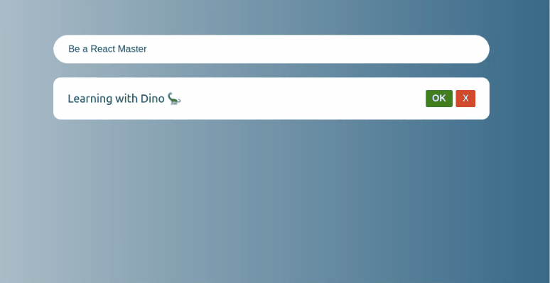

## React 101 🚀
An application that we developed in an introductory course to React + TypeScript with a client's technical team. 

To clone the repository:
```
git clone https://github.com/carobsts/to-do-list.git
```

To install:
```
npm install 
```

To start:
```
npm start
```

## To do list


